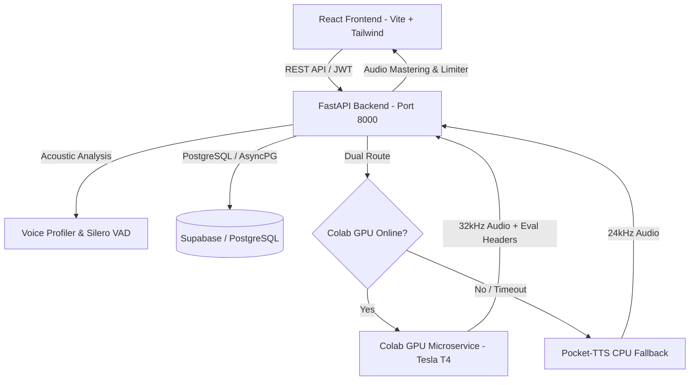

# IRIS VoiceLib 🎙️
### Production-Ready AI Voice Cloning & Emotion-Conditioned TTS Platform

[](https://opensource.org/licenses/MIT)
[](https://www.python.org/downloads/)
[](https://fastapi.tiangolo.com)
[](https://reactjs.org/)
[](https://vitejs.dev/)
[](https://tailwindcss.com/)

---

## 🌟 Overview

**IRIS VoiceLib** is a modern, full-stack AI voice cloning and expressive text-to-speech platform. It combines a zero-shot neural TTS engine (Chatterbox / GPT-SoVITS v3 / Pocket TTS) with automated voice profiling, high-fidelity audio DSP mastering, and objective multi-metric evaluation (ECAPA-TDNN speaker similarity & Whisper Word Error Rate).

---

## ✨ Key Features

- **🎭 Emotion & Expressiveness Conditioning**: 6 calibrated emotion presets (`neutral`, `calm`, `happy`, `excited`, `sad`, `angry`) with dynamic CFG guidance and exaggeration tuning.
- **🔒 Accent & Identity Lock**: Configurable CFG scaling (0.65–0.75 for neutral/calm) to preserve delicate accents and vocal timbre.
- **⚡ Dual Engine Architecture**:
  - **GPU Microservice**: Chatterbox TTS / GPT-SoVITS running on Google Colab (Tesla T4 GPU) via secure Ngrok tunnel.
  - **Local CPU Fallback**: Kyutai Labs' `pocket-tts` for instant offline synthesis.
- **📊 Real-time Objective Evaluation**:
  - **Speaker Similarity (`X-Speaker-Similarity`)**: 192-dimensional ECAPA-TDNN cosine similarity embeddings.
  - **Content Accuracy (`X-Word-Error-Rate`)**: Transcribed via faster-whisper (`small.en`) and scored via JiWER.
  - **Prosody Dynamic Diagnostic (`X-Prosody-Variance`)**: Pitch ($F_0$) standard deviation tracking across voiced frames.
- **🎛️ Acoustic Preprocessing & DSP**: Silero-VAD SNR segment selection, high-pass filtering, and peak normalization.
- **💎 Modern Web UI**: Ethereal Glassmorphism UI built with React 18, Tailwind CSS, waveform audio visualization, and real-time Colab connection status.

---

## 🏗️ System Architecture



---

## 🚀 Quick Start Guide

### 1. Prerequisites
- Python 3.11+
- Node.js 18+ and npm
- (Optional) Google Colab account for free GPU acceleration

---

### 2. Backend Setup
```bash
# Navigate to backend directory
cd voicelib/backend

# Create & activate virtual environment
python -m venv venv
# Windows:
venv\Scripts\activate
# Linux/macOS:
source venv/bin/activate

# Install dependencies
pip install -r requirements.txt

# Configure environment
cp .env.example .env
# Edit .env with your database string & Colab GPU URL

# Start FastAPI server
uvicorn app.main:app --reload --port 8000
```

---

### 3. Frontend Setup
```bash
# Navigate to frontend directory
cd voicelib/frontend

# Install dependencies
npm install

# Start Vite development server
npm run dev
```
Open **`http://localhost:5173`** in your browser.

---

### 4. Free Colab GPU Acceleration Setup
1. Open the included notebook [`voice_cloning_colab.ipynb`](./voice_cloning_colab.ipynb) in **[Google Colab](https://colab.research.google.com/)**.
2. Go to **Runtime → Change runtime type → Select T4 GPU**.
3. Run all cells sequentially.
4. When Cell 5 runs, paste your free [Ngrok Auth Token](https://dashboard.ngrok.com/get-started/your-authtoken).
5. Copy the printed `https://xxxx.ngrok-free.dev` public URL into `voicelib/backend/.env` under `COLAB_GPU_API_URL`.

---

## 🎭 Emotion & Guidance Parameters

| Emotion | Exaggeration | CFG Weight | Characteristic |
| :--- | :--- | :--- | :--- |
| **`neutral`** | `0.05` | `0.70` | Tight accent lock, clean balanced delivery |
| **`calm`** | `0.00` | `0.75` | Maximum speaker identity & timbre preservation |
| **`happy`** | `0.25` | `0.55` | Lively pitch excursion, positive inflection |
| **`excited`** | `0.40` | `0.45` | High dynamic range, energetic cadence |
| **`sad`** | `0.15` | `0.65` | Slower pacing, gentle downward pitch contour |
| **`angry`** | `0.35` | `0.50` | Sharp attack, higher vocal strain & intensity |

---

## 🔒 Security & Privacy

- All sensitive keys (`DATABASE_URL`, `NGROK_AUTHTOKEN`, `JWT_SECRET_KEY`) are managed strictly through environment variables.
- All local `.env` files, audio caches (`local_storage_data/`), and model checkpoints are ignored in `.gitignore`.

---

## 📄 License
This project is open-source and licensed under the [MIT License](LICENSE).